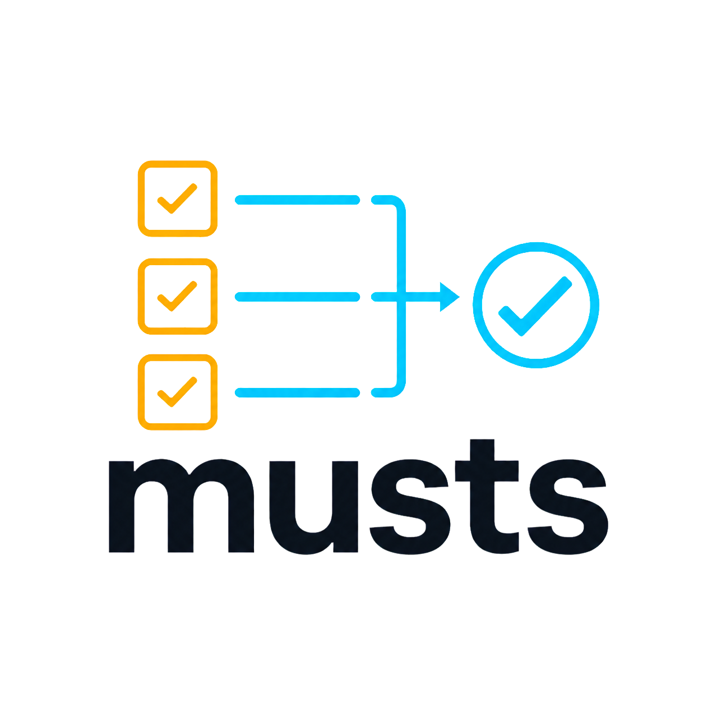
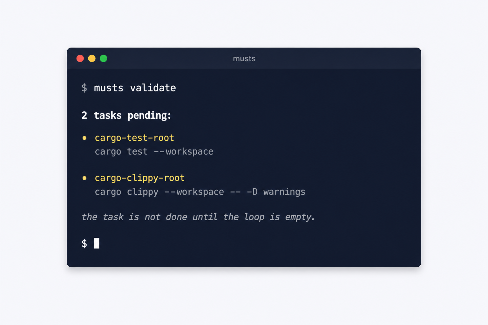
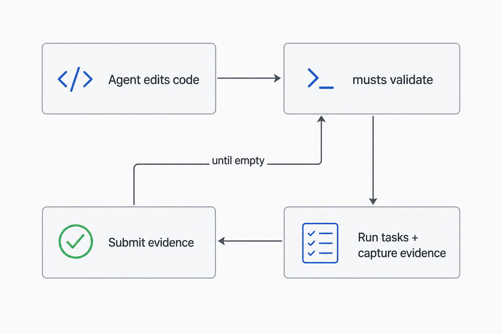
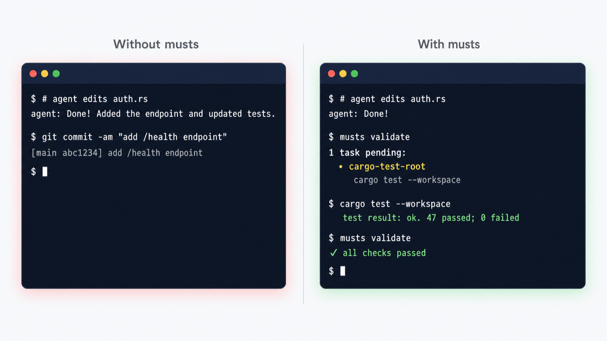

<p align="left">
  
</p>

# musts

[](https://github.com/bitomule/musts/actions/workflows/ci.yml)
[](https://crates.io/crates/musts)
[](rust-toolchain.toml)
[](#license)

AI agents are fast at editing code. They are less reliable at knowing when
verification is actually finished.

`musts` gives your repository a local, enforceable definition of done:

> The task is not done until `musts validate` is empty.

<p align="center">
  
</p>

Instead of hoping the agent remembers every build, test, UI check, and
architecture rule, you declare those checks next to the code they protect.
When files change, `musts validate` reports the exact validation tasks still
pending. The agent runs them, records evidence, and repeats until the report
is clean.

## Get Started

### 1. Install the CLI

```bash
# Homebrew (macOS / Linux)
brew install bitomule/tap/musts

# Cargo (from crates.io)
cargo install musts --locked

# Precompiled binaries
cargo binstall musts        # or download directly from GitHub Releases
```

### 2. Create your first `MUSTS.yml`

Put a `MUSTS.yml` at the root of your repo:

```yaml
checks:
  test:
    uses: cargo/test
```

Now ask what still needs to be validated:

```bash
musts validate
```

If code covered by that manifest has changed, `musts` returns a concrete task
for the agent to complete. After running the requested command, the agent
records evidence:

```bash
cargo test --workspace 2>&1 | tee /tmp/musts-cargo-test.log

musts evidence cargo-test-root \
  --text "cargo test --workspace passed" \
  --asset /tmp/musts-cargo-test.log

musts validate
```

When `musts validate` is empty, the repo has fresh evidence for the current
workspace state.

### 3. Tell your agent to obey the loop

For Claude Code, install the plugin. It bundles the `musts` skill and a
`Stop` hook that runs `musts validate` whenever Claude tries to finish a turn:

```text
/plugin marketplace add bitomule/musts
/plugin install musts@musts
```

See [`docs/claude-code-plugin.md`](docs/claude-code-plugin.md) for install,
update, uninstall, and private-fork details.

For other agents, add the rule to your `AGENTS.md`, `CLAUDE.md`, or equivalent
repo instructions:

```md
Before declaring a code change done, run `musts validate`.
Treat every reported task as required. Run the task, capture evidence outside
the workspace, submit it with `musts evidence`, and repeat until
`musts validate` is empty.
```

The CLI is agent-agnostic. Anything that can run shell commands can participate
in the loop.

## What You Can Encode

`musts` is not limited to "run the test suite". A check can represent any
validation rule your repo needs before an agent is allowed to stop.

### Build and test checks

```yaml
checks:
  fmt:
    uses: cargo/fmt
  clippy:
    uses: cargo/clippy
  test:
    uses: cargo/test
```

### Targeted build checks

```yaml
checks:
  app-build:
    uses: bazel/build
    with:
      target: //App:App
```

Use `exclude_paths` to carve files out of a check's scope so editing them
doesn't re-open it — for example a version file bumped by release automation:

```yaml
checks:
  app-build:
    uses: bazel/build
    exclude_paths:
      - "tools/config.bzl"   # release automation bumps build_number here
    with:
      target: //App:App
```

`exclude_paths` applies after `paths`. Note that musts does **not** support
gitignore-style `!` negation inside `paths:` (it would silently match
nothing) — a leading `!` is now rejected with a manifest error pointing you
at `exclude_paths`.

### Product or architecture contracts

Use the built-in `agent` capability when the validation is a judgement call
that needs a human-readable answer rather than a command exit code:

```yaml
checks:
  usecase-shape:
    uses: agent
    paths:
      - "Sources/App/UseCases/**"
    with:
      facts:
        - "Every use case has exactly one public entry point."
        - "The entry point name describes the user action, not implementation detail."
        - "No use case reaches across module boundaries except through declared ports."
```

When a matching use case changes, `musts validate` asks the agent to verify
those facts and submit a text explanation. That makes repo-specific rules
visible, repeatable, and hard to forget.

### UI and device checks

`musts` can also gate flows that need screenshots, videos, JSON reports, or
other assets. Built-in and third-party capabilities decide what evidence they
need; the agent should follow the `evidence:` and `submit:` lines in the
`musts validate` report.

## How The Loop Works

<p align="center">
  
</p>

1. You place `MUSTS.yml` files next to the code they protect.
2. The agent edits code.
3. `musts validate` fingerprints the relevant files and finds checks whose
   current scope is no longer covered by accepted evidence.
4. Each capability turns dirty checks into concrete tasks.
5. The agent runs those tasks and submits evidence with `musts evidence`.
6. The loop repeats until `musts validate` is empty.

The ledger is content-based, not git-based. Comments, generated fixtures,
architecture docs, and source files all count if they are inside a check's
scope. That conservative model is intentional: `musts` does not guess whether
a change was "semantic enough" to need validation.

## Why `musts`?

### Why not just run `cargo test` or a Makefile?

Because the agent has to remember to do it. `make all` is a suggestion;
`musts validate` is a contract the turn cannot close around. The task list is
generated from what actually changed, so the repo does not need one giant
script for every possible validation path.

### Why not a pre-commit hook or CI-only check?

Pre-commit hooks can be skipped. CI runs after the agent has already stopped,
you have already moved on, and the context needed to fix the issue may be
gone. `musts` runs in the gap between "the agent says done" and "you believe
it".

### Why not just trust the agent?

Agents are good at finishing turns. They are not always good at finishing
work. `musts` makes a false "done" visible by moving verification into an
external, repo-owned loop.

<p align="center">
  
</p>

## Built-In Capabilities

The reference capabilities are built into the `musts` binary:

| Capability | Use it for |
| --- | --- |
| `agent` | Text-backed contracts, architectural checks, manual reasoning tasks |
| `cargo/fmt` | `cargo fmt --check` |
| `cargo/clippy` | `cargo clippy --workspace --all-targets -- -D warnings` |
| `cargo/test` | `cargo test --workspace` |
| `bazel/build` | Bazel target builds |
| `mav/expect` | Mobile Agent Verifier flows and device evidence |

Third-party extensions can add new capabilities in any language that speaks
the JSON-over-stdio protocol. See [`docs/extensions.md`](docs/extensions.md)
and the worked example in [`docs/examples/eslint-check/`](docs/examples/eslint-check/).

## Example: This Repo

`musts` validates itself on every PR. Its root manifest gates formatting,
linting, and tests; the protocol crate also carries an `agent` contract for
facts that should remain true across changes.

That dogfood loop is intentionally the same loop users run:

```bash
cargo build --release
./target/release/musts validate
# run the reported tasks
./target/release/musts evidence <task-id> --text "..." --asset /tmp/log
./target/release/musts validate
```

For contributor commands, release rules, and the required pre-PR validation
sequence, see [`CONTRIBUTING.md`](CONTRIBUTING.md).

## Used At

`musts` runs in production on:

- [Undolly](https://undolly.app) - finding duplicate photos
- [Boxy](https://boxy-app.com/) - organising physical items
- [HiddenFace](https://hiddenface.app) - privacy-first face blur

## Commands

```bash
musts validate                                 # report pending validation tasks
musts validate --json                          # machine-readable report
musts evidence <task-id> --text "..." \        # record evidence for a task
    --asset path/to/log --asset path/to/screen.png
```

Exit codes:

- `validate`: 0 clean, 1 pending tasks, 2 configuration / stale / lock error, 70 internal error.
- `evidence`: 0 accepted, 1 rejected by extension, 2 unknown task / stale snapshot / over-claim, 70 internal error.

## Stability

`musts` is pre-1.0. The CLI surface, extension protocol, and `MUSTS.yml`
schema may change between minor versions until `1.0`. The validation loop is
already used by this repository and by production apps, but you should expect
some API movement while the format settles.

## Docs

Start at [`docs/README.md`](docs/README.md) for the documentation index.

- [`docs/claude-code-plugin.md`](docs/claude-code-plugin.md) - Claude Code plugin and pre-commit validation hook.
- [`docs/skill.md`](docs/skill.md) - copyable agent instructions for the validation loop.
- [`docs/extensions.md`](docs/extensions.md) - how to write a third-party extension.
- [`docs/architecture.md`](docs/architecture.md) - bird's-eye view of the crates.
- [`docs/musts-design.md`](docs/musts-design.md) - design spec and protocol decisions.
- [`docs/PLAN.md`](docs/PLAN.md) - implementation plan and historical contract notes.

Advanced topics:

- [`.mustsignore`](docs/musts-design.md#55-workspace-mustsignore) - exclude committed generated files or canonical fixtures from scope hashes.
- [`CONTRIBUTING.md`](CONTRIBUTING.md) - build, test, release, and PR-title rules.

## License

Licensed under either of [Apache License, Version 2.0](LICENSE-APACHE) or
[MIT license](LICENSE-MIT) at your option.

Unless you explicitly state otherwise, any contribution intentionally submitted
for inclusion in this project by you, as defined in the Apache-2.0 license,
shall be dual licensed as above, without any additional terms or conditions.
